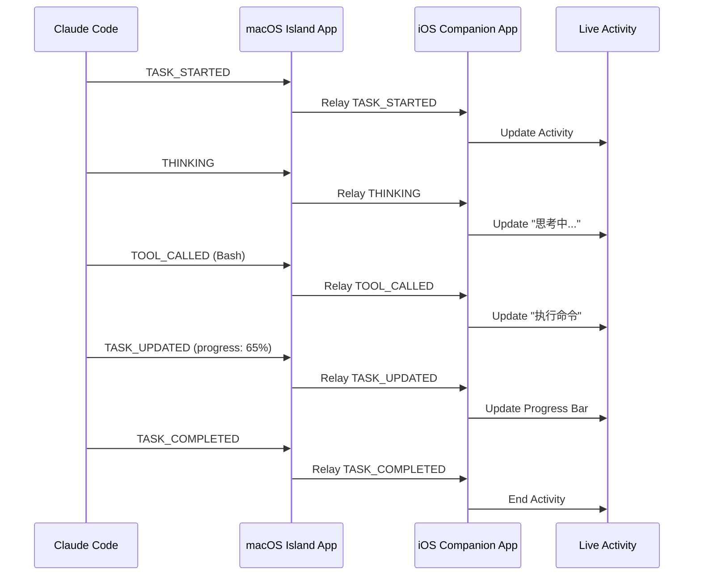
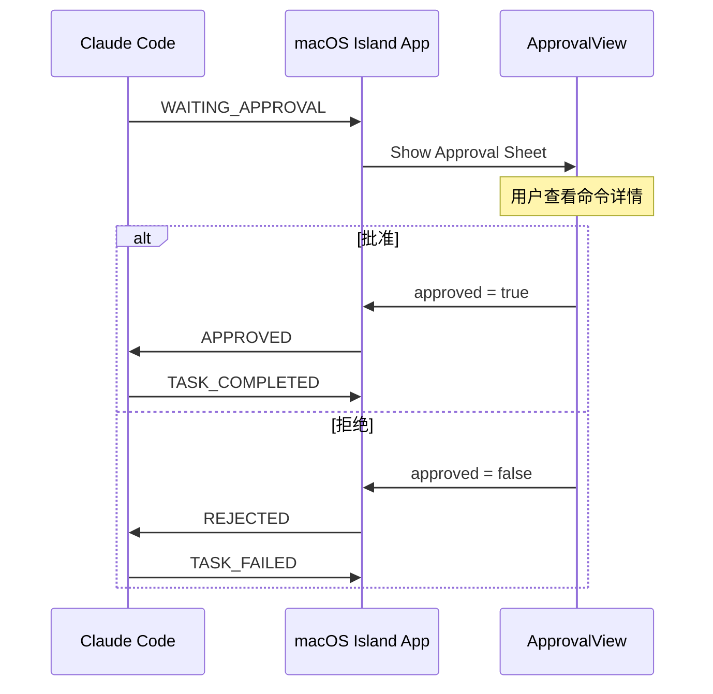
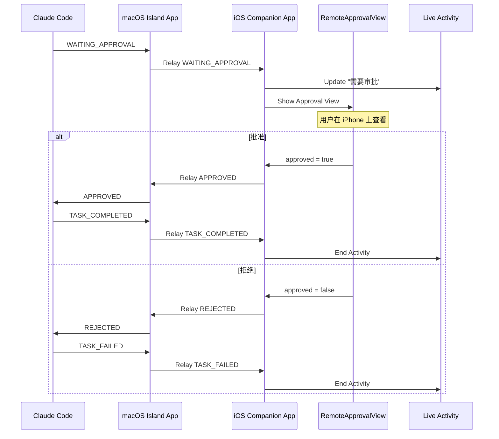
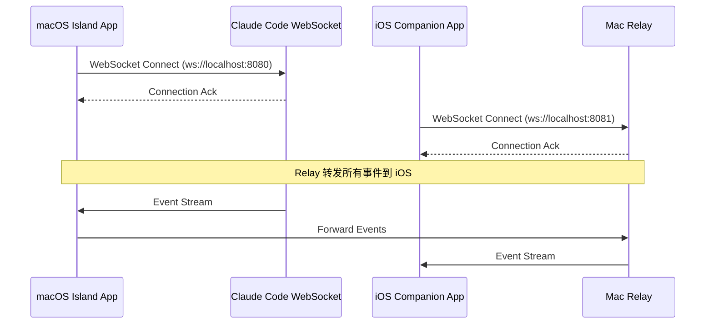
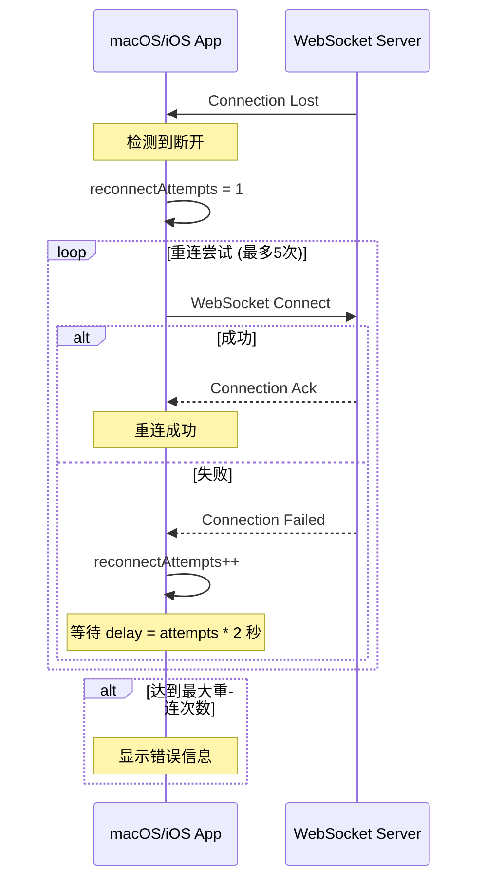
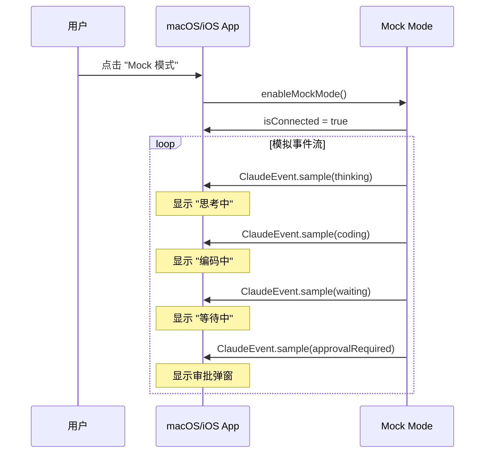
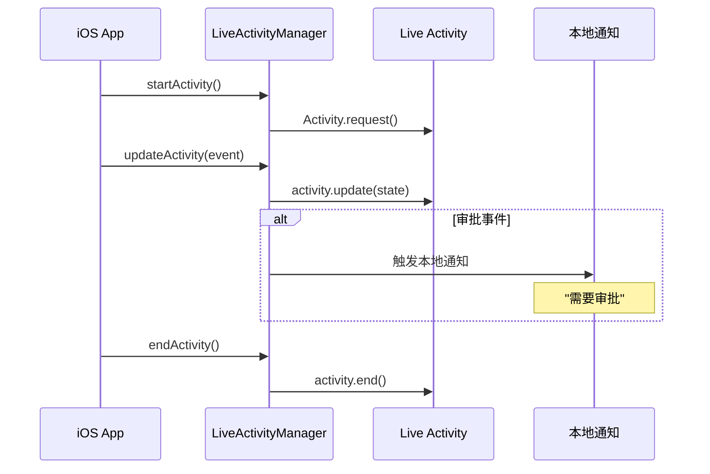
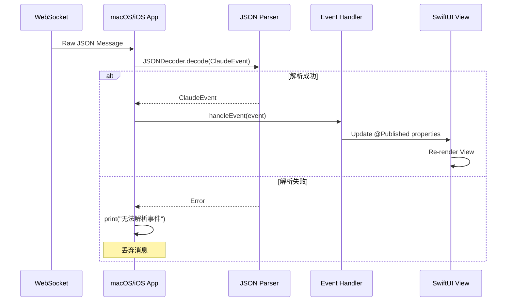
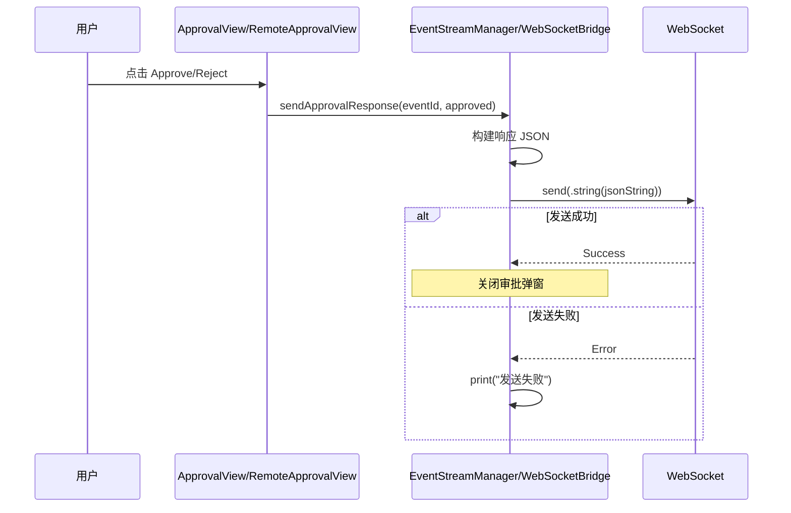
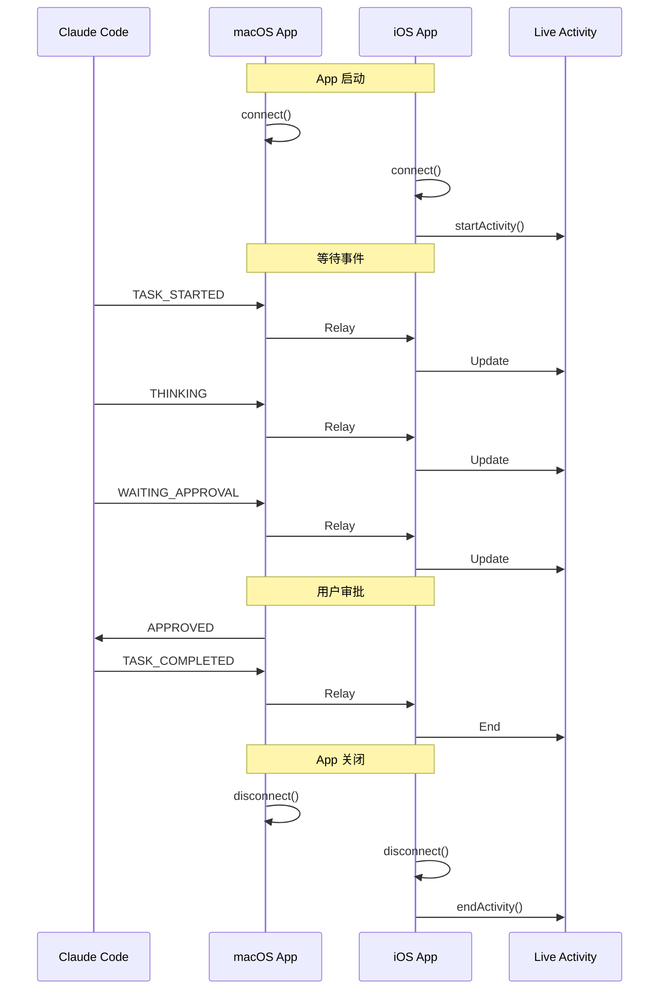

# Claude Code Island — 序列图

> 版本：1.0 | 更新时间：2026-06-22

---

## 一、正常执行流程

---

## 二、审批流程（macOS）

---

## 三、远程审批流程（iOS）

---

## 四、连接流程

---

## 五、断线重连流程

---

## 六、Mock 模式流程

---

## 七、Live Activity 更新流程

---

## 八、事件处理流程

---

## 九、审批响应发送流程

---

## 十、完整生命周期

